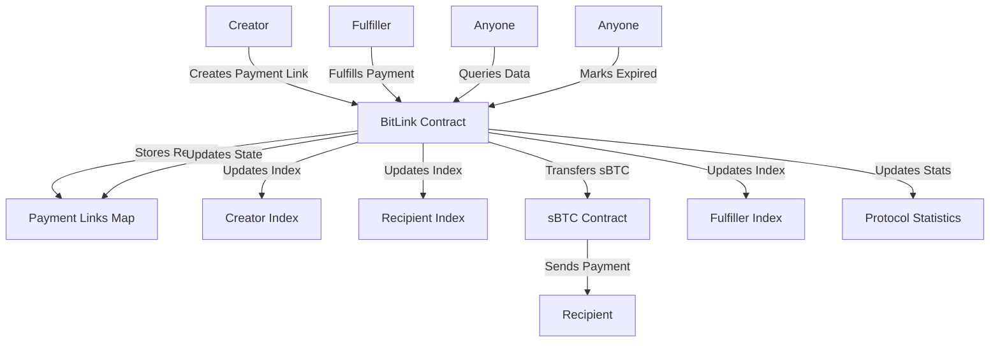
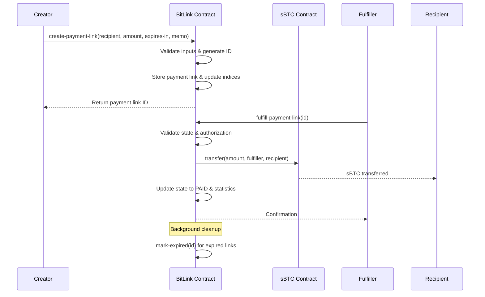

# BitLink Protocol

**Decentralized Bitcoin Payment Request System on Stacks Layer 2**

[](https://stacks.co)
[](https://bitcoin.org)
[](https://clarity-lang.org)

## Overview

BitLink revolutionizes Bitcoin payments by creating secure, time-bound payment requests that can be fulfilled by anyone on the Stacks blockchain. Built with Bitcoin sovereignty in mind, BitLink enables seamless sBTC transactions while maintaining the security and decentralization principles of Bitcoin.

### Key Features

- 🔒 **Trustless Payment Links** - No intermediaries required
- ⏰ **Time-Bound Requests** - Automatic expiration prevents stale payments
- 🔍 **Comprehensive Indexing** - Efficient querying by creator, recipient, and fulfiller
- 📊 **Real-Time Analytics** - Protocol statistics and payment tracking
- 🚀 **Batch Operations** - Optimized for high-throughput applications
- 💰 **sBTC Integration** - Native Bitcoin Layer 2 payments
- 🔐 **Self-Custody** - Users maintain full control of their assets

## System Overview



## Contract Architecture

### Core Components

#### 1. **Data Storage Layer**

```clarity
;; Primary storage for payment requests
payment-links: { id -> PaymentLink }

;; Indexing for efficient queries
links-by-creator: { creator -> [ids] }
links-by-recipient: { recipient -> [ids] }
links-by-fulfiller: { fulfiller -> [ids] }
```

#### 2. **State Management**

- **Pending**: Awaiting fulfillment
- **Paid**: Successfully completed
- **Expired**: Timed out
- **Canceled**: Creator canceled

#### 3. **Access Control**

- **Creators**: Can create and cancel their payment links
- **Fulfillers**: Can fulfill any pending, non-expired payment link
- **Public**: Can query data and mark expired links

### Data Flow



## Installation & Deployment

### Prerequisites

- [Clarinet](https://github.com/hirosystems/clarinet) for local development
- [Stacks CLI](https://docs.stacks.co/docs/write-smart-contracts/cli-wallet-quickstart) for deployment
- Access to a Stacks node (mainnet/testnet)

### Local Development

```bash
# Clone the repository
git clone https://github.com/luc-effiong/bit-link.git
cd bit-link

# Install Clarinet (if not already installed)
curl -L https://github.com/hirosystems/clarinet/releases/latest/download/clarinet-linux-x64.tar.gz | tar xz
sudo mv clarinet /usr/local/bin

# Initialize and test
clarinet check
clarinet test
```

### Deployment

```bash
# Deploy to testnet
clarinet deployments apply -p testnet

# Deploy to mainnet
clarinet deployments apply -p mainnet
```

## Usage Guide

### Creating Payment Links

```clarity
;; Create a payment request for 1000 sats (0.00001 BTC) expiring in 1440 blocks (~1 day)
(contract-call? .bitlink create-payment-link
  'ST1RECIPIENT-ADDRESS
  u100000000  ;; 1000 sats in smallest unit
  u1440       ;; ~1 day in blocks
  (some "Invoice #12345 - Web Development Services"))
```

### Fulfilling Payment Links

```clarity
;; Fulfill payment link with ID 42
(contract-call? .bitlink fulfill-payment-link u42)
```

### Querying Data

```clarity
;; Get payment link details
(contract-call? .bitlink get-payment-link u42)

;; Get all links created by a user
(contract-call? .bitlink get-creator-links 'ST1CREATOR-ADDRESS)

;; Get protocol statistics
(contract-call? .bitlink get-protocol-stats)
```

## API Reference

### Public Functions

| Function | Description | Parameters | Returns |
|----------|-------------|------------|---------|
| `create-payment-link` | Create new payment request | `recipient`, `amount`, `expires-in`, `memo` | `link-id` |
| `fulfill-payment-link` | Complete a payment | `id` | `link-id` |
| `cancel-payment-link` | Cancel pending payment (creator only) | `id` | `link-id` |
| `mark-expired` | Mark expired link for cleanup | `id` | `link-id` |
| `get-multiple-links` | Batch retrieve payment links | `ids` | `[PaymentLink]` |

### Read-Only Functions

| Function | Description | Returns |
|----------|-------------|---------|
| `get-payment-link` | Get specific payment link | `PaymentLink` |
| `get-creator-links` | Get links by creator | `[link-id]` |
| `get-recipient-links` | Get links by recipient | `[link-id]` |
| `get-fulfiller-links` | Get links by fulfiller | `[link-id]` |
| `get-protocol-stats` | Get protocol metrics | `ProtocolStats` |
| `get-link-status` | Get enhanced link status | `LinkStatus` |

## Architecture Decisions

### Design Principles

1. **Bitcoin Sovereignty**: Built on Stacks to leverage Bitcoin's security
2. **Trustless Operation**: No intermediaries or custodial elements
3. **Efficient Indexing**: Multiple indices for optimized queries
4. **Automatic Cleanup**: Time-based expiration prevents stale data
5. **Batch Processing**: Optimized for high-throughput applications

### Security Considerations

- **Input Validation**: Comprehensive validation on all user inputs
- **State Consistency**: Atomic operations prevent race conditions
- **Access Control**: Proper authorization for sensitive operations
- **Overflow Protection**: Safe arithmetic operations throughout
- **Expiration Enforcement**: Automatic prevention of expired payments

### Scalability Features

- **Indexed Storage**: O(1) lookups by creator, recipient, fulfiller
- **Batch Operations**: Process multiple operations efficiently
- **Event Emission**: Enable off-chain indexing and monitoring
- **Configurable Limits**: Adjustable batch sizes and expiration limits

## Economic Model

### Fee Structure

- **Creation**: Gas fees only (no protocol fees)
- **Fulfillment**: Gas fees + sBTC transfer fees
- **Queries**: Free (read-only operations)

### Protocol Statistics

- Total payment links created
- Total successful fulfillments
- Total volume processed
- Real-time activity metrics

## Use Cases

### 1. **E-commerce Invoicing**

Create payment links for online sales with automatic expiration

### 2. **Freelancer Payments**

Request payments for services with detailed memos

### 3. **Crowdfunding**

Accept contributions from multiple fulfillers

### 4. **Peer-to-Peer Transactions**

Simple payment requests between individuals

### 5. **Subscription Services**

Recurring payment link generation

## Integration Examples

### Frontend Integration

```javascript
// Using Stacks.js
import { openContractCall } from '@stacks/connect';

const createPaymentLink = async (recipient, amount, memo) => {
  await openContractCall({
    contractAddress: 'SP...',
    contractName: 'bitlink',
    functionName: 'create-payment-link',
    functionArgs: [
      principalCV(recipient),
      uintCV(amount),
      uintCV(1440), // 1 day
      someCV(stringAsciiCV(memo))
    ]
  });
};
```

### Backend Integration

```python
# Using Python Stacks API
import requests

def get_payment_link(link_id):
    response = requests.post('https://stacks-node-api.mainnet.stacks.co/v2/contracts/call-read/SP.../bitlink/get-payment-link', 
        json={'arguments': [f'0x{link_id:016x}']})
    return response.json()
```

## Testing

### Unit Tests

```bash
# Run all tests
clarinet test

# Run specific test file
clarinet test tests/bitlink_test.ts
```

### Integration Tests

```bash
# Test against local devnet
clarinet integrate

# Test specific scenarios
clarinet integrate --scenario payment-flow
```

## Monitoring & Analytics

### Event Tracking

The contract emits structured events for:

- Payment link creation
- Payment fulfillment
- Link cancellation
- Link expiration

### Metrics Dashboard

Monitor protocol health through:

- Creation rate
- Fulfillment rate
- Average payment size
- Expiration patterns

## Contributing

We welcome contributions to BitLink! Please see our [Contributing Guidelines](CONTRIBUTING.md) for details on:

- Code style and standards
- Testing requirements
- Pull request process
- Issue reporting

## Roadmap

### Phase 1: Core Protocol ✅

- Basic payment link functionality
- Time-based expiration
- Comprehensive indexing

### Phase 2: Enhanced Features 🚧

- Multi-token support
- Recurring payments
- Payment splitting

### Phase 3: Advanced Integration 📋

- Cross-chain compatibility
- Lightning Network integration
- Mobile SDK
